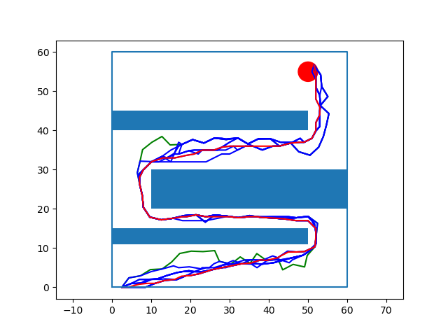

# Robot Motion Planning Final Project

#### Title: Rapidly-exploring Random Trees for UAVs in an Urban Environment

#### Authors: Carter Berlind, Adam Rozman, Charles DeLorey

GitHub repository for our final project for ME570, Robot Motion Planning. Our novelty consists of an implementation of the Rapidly exploring Random Trees (RRT) algorithm, more specifically the RRT* algorithm. RRT and RRT* are explained below. 

### RRT:
Random points are found in the configuration space, and are connected to their nearest node (avoiding collisions and obstacles). This creates a random growing tree, which eventually will converge to the goal region.

### RRT*:

Based off of RRT, but differs in two key ways.
  
- Connects new nodes to the nearest neighbor with the lowest cost
- If the cost would be reduced by restructuring the tree, the tree is "rewired" to reduce that local cost

These two added features enable RRT* to converge faster on an optimal solution, as well as refine paths that are already found.

