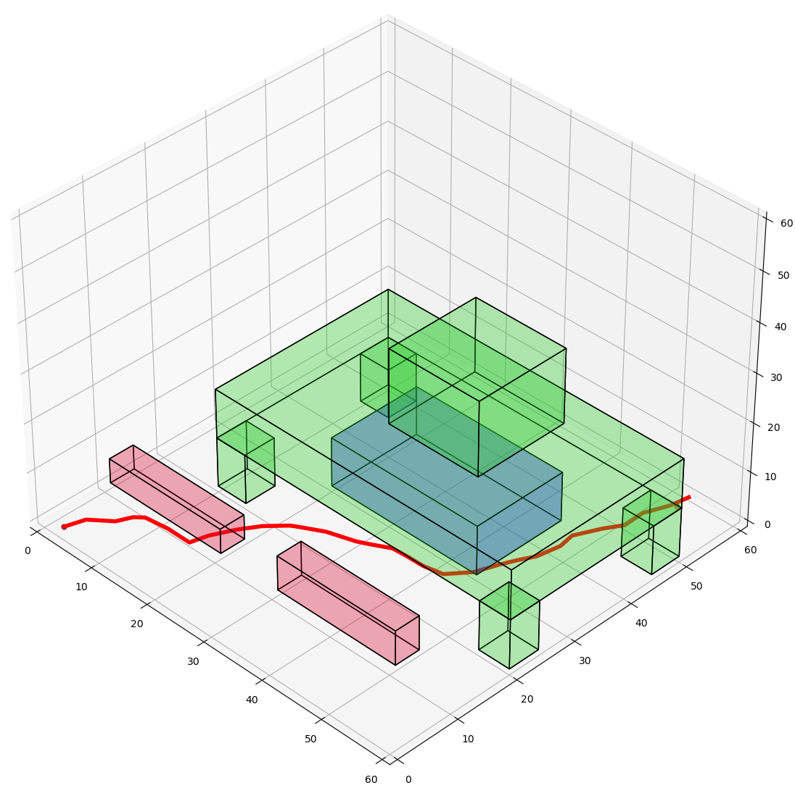

# Robot Motion Planning Final Project

#### Title: Rapidly-exploring Random Trees for UAVs in an Urban Environment

#### Authors: Carter Berlind, Adam Rozman, Charles DeLorey

GitHub repository for our final project for ME570, Robot Motion Planning. Our novelty consists of an implementation of the Rapidly exploring Random Trees (RRT) algorithm, more specifically the RRT* algorithm. RRT and RRT* are explained below. 

### RRT:
Random points are found in the configuration space, and are connected to their nearest node (avoiding collisions and obstacles). This creates a random growing tree, which eventually will converge to the goal region.

### RRT*:

Based off of RRT, but differs in two key ways.
  
- Connects new nodes to the nearest neighbor with the lowest cost
- If the cost would be reduced by restructuring the tree, the tree is "rewired" to reduce that local cost

These two added features enable RRT* to converge faster on an optimal solution, as well as refine paths that are already found.

### Required dependencies:

#### Python:
- Matplotlib
- NumPy
- NetworkX

#### MATLAB:
- UAV Toolbox
- Simulink

### Running the code

Each file should be executable individually, with a representative example contained in the `main()` for each file. 

The pipeline for generating a path based on an environment and bringing it into MATLAB for simulation is as follows:

1. Import the corresponding path planning functions from `me570_RRT_Project.py` (`rrt()`) or `me570_RRTStar_Project.py` (`rrt_star()`)
2. Provide the planning function the necessary parameters `World, Start, End, Obstacles, Resolution, egoSize, nodes, nodePoses, tree, pathFound, itr, itr_max, s_radius`.
3. Running the algorithm yields `tree, nodes, nodePoses, path_found, final_path`.
- You can visualize the path in the environment using Matplotlib if you use the `graph()` function, also included in the algorithm files.
4. The path is saved to a `.txt` file as three columns: x, y, z.
5. Open MATLAB and ensure you are in the same directory containing the path files.

To run the 2D simulation:
6. Open and run `UAVScenarioTutorialExampleCharlie.mlx`, a program based on a live script from the MATLAB UAV Toolbox. 
7. This script will load the previous path data as the waypoints for the simulation, as well as the obstacle coordinates, and create and run a simulation of a quadcopter moving from the start and end positions along the given path. 

To run the 3D simulation:
8. Open and run `UAVScenarioTutorialExampleCharlie3D.mlx`.

